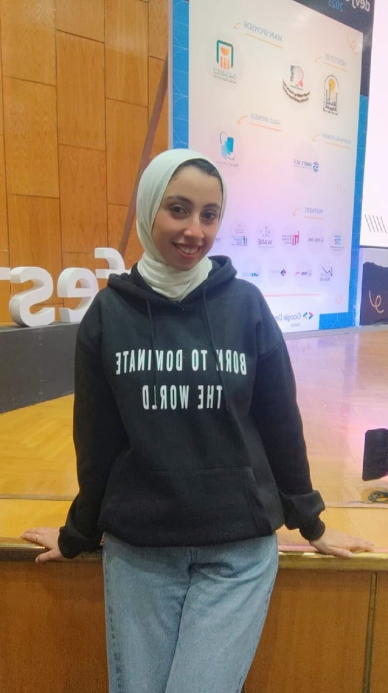
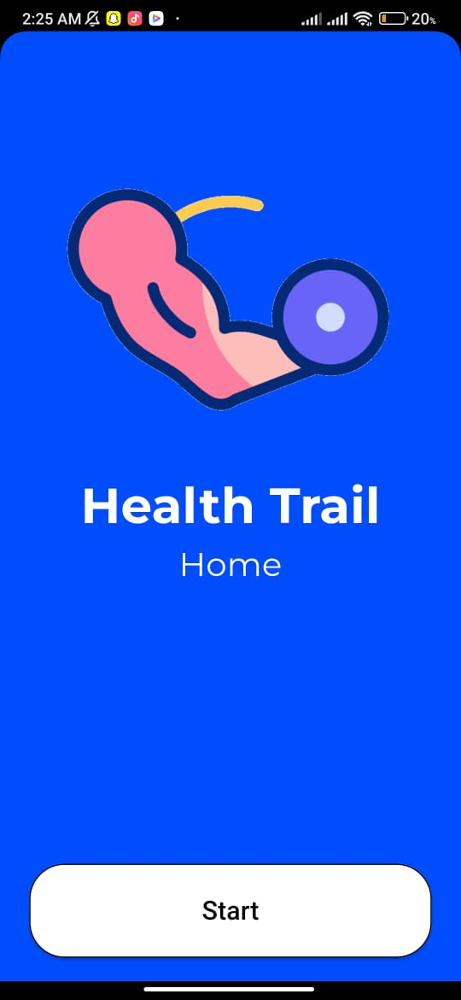
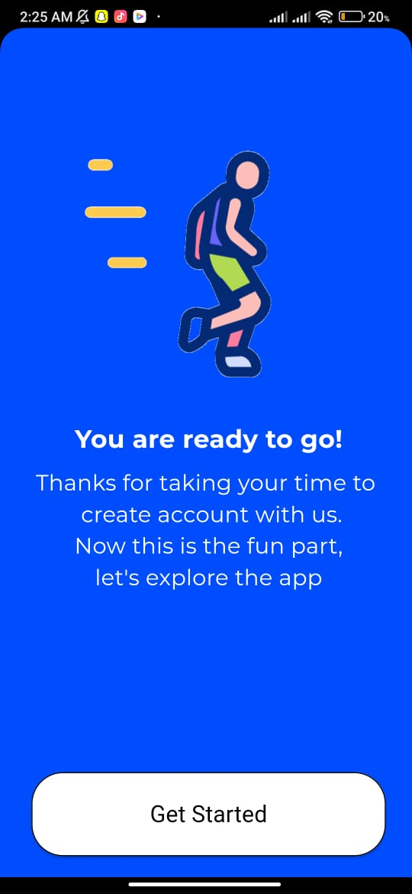
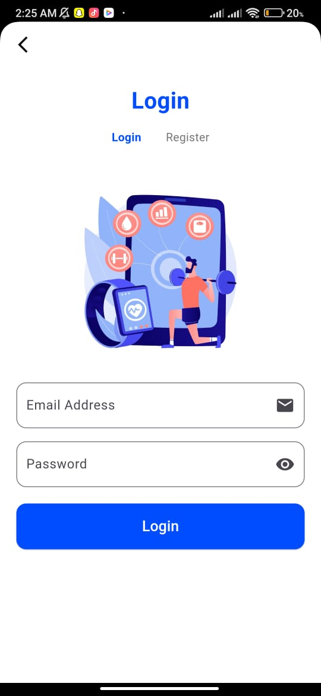

<!DOCTYPE html>
<html lang="en">
<head>
    <meta charset="UTF-8">
    <meta name="viewport" content="width=device-width, initial-scale=1.0">
    <title>Sarah Ahmed - Mobile Developer</title>
    <link href="https://cdnjs.cloudflare.com/ajax/libs/font-awesome/6.0.0-beta3/css/all.min.css" rel="stylesheet">
    
</head>
<body>
    <header>
        

            
Sarah Ahmed

            <nav>
                <ul>
                    <li><a href="#home">Home</a></li>
                    <li><a href="#about">About</a></li>
                    <li><a href="#projects">Projects</a></li>
                    <li><a href="#skills">Skills</a></li>
                    <li><a href="#contact">Contact</a></li>
                </ul>
            </nav>
        

    </header>

    <section id="home" class="hero">
        <h1 class="fade-in">Sarah Ahmed</h1>
        
Mobile Developer

        <a href="#projects" class="btn fade-in">View My Work</a>
    </section>

    <section id="about" class="about">
        

            <h2 class="section-title">About Me</h2>
            

                

                    
Hello! I'm Sarah Ahmed, a fresh graduate from Assiut University's Faculty of Computers and Informatics. I'm passionate about mobile development and currently volunteering as a Monitor at Google Developer Student Club (GDSC).

                    
My journey in mobile development began during my university years, where I honed my skills in Java, Kotlin, OOP principles, Dart, and Flutter. I'm dedicated to applying these skills to real-world projects and staying updated with the latest technological advancements.

                    
As a GDSC Monitor, I help students with mobile development courses, providing feedback and assisting with problem-solving to ensure effective learning outcomes. I'm excited about the opportunity to grow in the field of mobile development and contribute to innovative projects that make an impact.

                

                

                    
                

            

        

    </section>

    <section id="projects" class="projects">
        <h2 class="section-title">My Projects</h2>

        <!-- Project 1 -->
        

            

                
                
                
            

            

                <h3>Digital Copyrights</h3>
                
A social network platform that helps prevent unauthorized sharing of digital content using Python, Flutter, Django, and PostgreSQL.

            

        

        <!-- Project 2 -->
        

            

                
                
                
            

            

                <h3>Todo App</h3>
                
A simple yet effective task management app built with Flutter, Dart, and a local database.

            

        

        <!-- Project 3 -->
        

            

                
                
                
            

            

                <h3>News App</h3>
                
A dynamic news app that delivers the latest articles using Flutter and a REST API.

            

        

        <!-- Project 4: Health Trial -->
        

            

                
                
                
            

            

                <h3>Health Trial</h3>
                
A health tracking app developed as part of a team project. This app combines a user-friendly interface with features like activity tracking, water intake monitoring, and exercise plans. Built using Flutter and Firebase.

            

        

    </section>

    <section id="skills">
        <h2 class="section-title">My Skills</h2>
        

            
<i class="fab fa-java"></i> Java

            
<i class="fab fa-dart"></i> Dart

            
<i class="fab fa-flutter"></i> Flutter

            
<i class="fas fa-cogs"></i> OOP

            
<i class="fas fa-pencil-ruler"></i> UI/UX Design

            
<i class="fas fa-server"></i> REST APIs

        

    </section>

    <footer id="contact">
        

            
&copy; 2024 Sarah Ahmed. All rights reserved.

            
<i class="fas fa-envelope"></i> sarah@example.com

        

    </footer>
</body>
</html>
